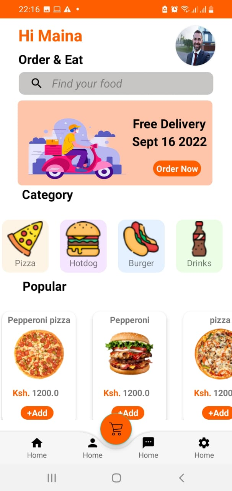

# Foodie
Thid is a simulated mobile application for food delivery

## Description
This application allows users to view all the food categories that can be delivered, select what they want indicating the number of pieces, add them to the cart where all the summary and computation is done for payments. The payemnet is inclusive of VAT and delivery fee.

#### By **[JOSEPH MAINA](https://github.com/JOSEPHMAINA1995)** 

## Prerequisite
* A complete Laptop or desktop machine installed any operating system of your choise
* Internet connection for stable working environment
* Android studio
* Emulator or an android mobile device
* JDK	

## Features

* Welcome page where you are prompted to get started
* The main page which contains all the food items both the categories and the popular food for selection
* The cart and the bottom Navigation
* The cartlist where the summary and computation is done.
## Technologies Used

* android studio
* Java
* XML for designing the frontend
* Firebase

## Technologies Used
The cartlist does not show the summary of the items selected and the computation. Solution is being sought.

### License

MIT License
Permission is hereby granted, free of charge, to any person obtaining a copy
of this software and associated documentation files (the "Software"), to deal
in the Software without restriction, including without limitation the rights
to use, copy, modify, merge, publish, distribute, sublicense, and/or sell
copies of the Software, and to permit persons to whom the Software is
furnished to do so, subject to the following conditions:

The above copyright notice and this permission notice shall be included in all
copies or substantial portions of the Software.

THE SOFTWARE IS PROVIDED "AS IS", WITHOUT WARRANTY OF ANY KIND, EXPRESS OR
IMPLIED, INCLUDING BUT NOT LIMITED TO THE WARRANTIES OF MERCHANTABILITY,
FITNESS FOR A PARTICULAR PURPOSE AND NONINFRINGEMENT. IN NO EVENT SHALL THE
AUTHORS OR COPYRIGHT HOLDERS BE LIABLE FOR ANY CLAIM, DAMAGES OR OTHER
LIABILITY, WHETHER IN AN ACTION OF CONTRACT, TORT OR OTHERWISE, ARISING FROM,
OUT OF OR IN CONNECTION WITH THE SOFTWARE OR THE USE OR OTHER DEALINGS IN THE
SOFTWARE. 

Copyright (c) 2022 **[JOSEPH MAINA](https://github.com/JOSEPHMAINA1995)**
